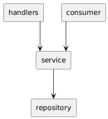

# nbrb project

**Начало работы**

- Запустите команду __docker-compose up;__
- Дождитесь запуска всех контейнеров.
- Для получения всех собранных записей запустите команду  __curl http://localhost:8080/getall__.
- Для получения всех записей за выбранную дату запустите команду  __curl http://localhost:8080/get?date=2024-10-03__ (для демонстрации использована дата 2024-10-03).

**Переменные проекта**

- __MYSQL_URL__="user:password@tcp(mysql:3306)/db" 
- __SERVER_PORT__=":8080"                              
- __SOURCE_URL__="https://api.nbrb.by/exrates/rates?periodicity=0"

**Принцип работы**

Сервис собирает валютные данные при запуске, затем начиная с 00:00:01 UTC каждого нового дня, сохраняет данные в ДБ, при запросе отдает собранные данные.

**Архитектура проекта** 

